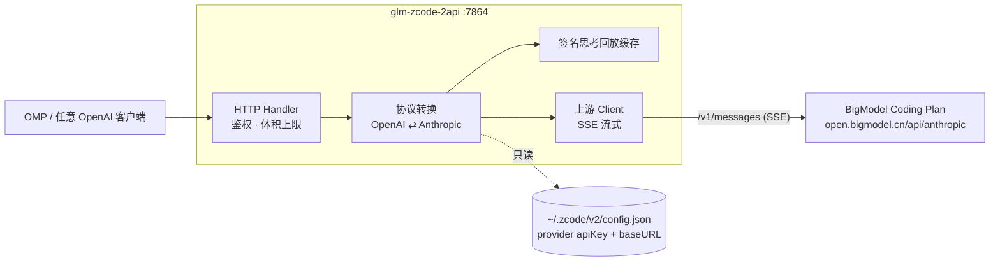

# glm-zcode-2api

> 项目主页 / Project site：<https://binggao1230.github.io/glm-zcode-2api/>

把本机 **ZCode** 账号（BigModel Coding Plan / Z.ai Coding Plan）变成 **OpenAI 兼容 API** 的本地反向代理，供 OMP 等任意 OpenAI 客户端使用。

- 上游是 Anthropic Messages 协议（`https://open.bigmodel.cn/api/anthropic`），本网关对外只暴露 `/v1/chat/completions`、`/v1/models`；
- 凭据**直接读 ZCode 的配置**（`~/.zcode/v2/config.json`），不复制、不改写 App 文件，密钥不写入 OMP 配置；
- 默认监听 `0.0.0.0:7864`（局域网可访问），`api_key` 为强制项；密钥由启动器生成，仅存本机 `~/.local/state/glm-zcode-2api/client.key`（0600）。

> ⚠️ 合规须知：本项目是**非官方**网关，使用你本人的 ZCode 账号作为上游，仅限本机 / 私有环境自用。上游接口与配额由智谱侧控制，可能随时变化。

## 架构



请求侧：system/developer → 顶层 `system`；`tool` 消息合并进同一条 user 消息的 `tool_result`；`tool_calls` → `tool_use`；`tool_choice` → `auto`/`any`/`tool`；`reasoning` 默认开启（`thinking.type=enabled` + `output_config.effort`，默认 `max`）；system 打 prompt cache 断点。

响应侧：`thinking_delta` → `reasoning_content`；`tool_use` + `input_json_delta` → `tool_calls`；`stop_reason` 映射 `stop` / `length` / `tool_calls`；usage 含缓存命中（`prompt_tokens_details.cached_tokens`）。

**签名思考回放**：Anthropic 协议要求工具循环中把带 `signature` 的 thinking 块原样回传，而 OpenAI 客户端只会回显可见文本。网关用「可见文本 + 工具调用」指纹（并辅以 tool_call id、推理文本两个索引）在内存 LRU 中缓存签名，下一轮自动补回，客户端无需感知。

## 快速开始

```bash
cd ~/projects/ai_projects/glm-zcode-2api
CGO_ENABLED=0 go build -trimpath -ldflags="-s -w" -o bin/glm-zcode-2api ./cmd/server

# 启动（读取 ZCode 配置、生成客户端密钥、后台常驻）
python3 scripts/omp-gateway.py start

# 健康检查
curl -s http://127.0.0.1:7864/healthz
# {"service":"glm-zcode-2api","healthy":true,"provider":"builtin:bigmodel-coding-plan","models":2}
```

管理命令：

```bash
python3 scripts/omp-gateway.py status    # 运行状态 + health
python3 scripts/omp-gateway.py restart   # 重新登录 ZCode / 切换套餐后同步
python3 scripts/omp-gateway.py stop
python3 scripts/omp-gateway.py token     # 打印客户端密钥（OMP 按需启动时用）
```

验证：

```bash
KEY=$(python3 scripts/omp-gateway.py token)

curl -s http://127.0.0.1:7864/v1/models -H "Authorization: Bearer $KEY"

curl -sN http://127.0.0.1:7864/v1/chat/completions \
  -H "Authorization: Bearer $KEY" -H 'Content-Type: application/json' \
  -d '{"model":"glm-5.3-flash","messages":[{"role":"user","content":"hi"}],"stream":true}'
```

## 局域网访问

网关绑定所有网卡（`0.0.0.0:7864`），同网段其他设备直接可用：

```bash
# 本机取密钥
KEY=$(python3 ~/projects/ai_projects/glm-zcode-2api/scripts/omp-gateway.py token)

# 局域网设备上（示例 IP：192.168.x.x）
curl -s http://192.168.x.x:7864/healthz
curl -s http://192.168.x.x:7864/v1/models -H "Authorization: Bearer $KEY"
```

其他机器的 OMP 只需把 `baseUrl` 换成局域网地址并填同一个密钥：

```yaml
  zcode:
    baseUrl: http://192.168.x.x:7864/v1
    api: openai-completions
    apiKey: "<上面那份 client.key>"
    authHeader: true
```

要点：

- `/v1/models`、`/v1/chat/completions`、`/status` 都要 `Authorization: Bearer <api_key>`（或 `x-api-key`）；仅 `/healthz` 不鉴权，用于探活。
- 密钥即账号额度：`~/.local/state/glm-zcode-2api/client.key` 权限 0600，别贴进聊天或提交到仓库；泄漏就删掉该文件后 `restart` 重新生成。
- 首次从别的设备连接时，macOS 防火墙可能弹出「是否允许传入连接」，需要放行。

## OMP 接入

`~/.omp/agent/models.yml`：

```yaml
  zcode:
    baseUrl: http://127.0.0.1:7864/v1
    api: openai-completions
    apiKey: '!/usr/bin/python3 ~/projects/glm-zcode-2api/scripts/omp-gateway.py token'
    authHeader: true
    compat:
      supportsStore: false
      supportsDeveloperRole: false
      maxTokensField: max_tokens
    models:
    - id: glm-5.3
      name: ZCode / GLM-5.3
      reasoning: true
      input: [text]
      contextWindow: 1000000
      maxTokens: 128000
    - id: glm-5.3-flash
      name: ZCode / GLM-5.3-Flash
      reasoning: true
      input: [text, image]
      contextWindow: 1000000
      maxTokens: 128000
```

凭据解析命令会**按需拉起网关**（未运行则自动 `start`），因此无需手工常驻：

```bash
omp --model zcode/glm-5.3-flash
omp models zcode
```

## 配置说明

`config.example.json` 是完整参考；实际运行配置由启动器写入 `~/.local/state/glm-zcode-2api/config.json`。

| 字段 | 默认 | 说明 |
|---|---|---|
| `listen` | `0.0.0.0:7864` | 监听地址：`0.0.0.0` = 局域网可访问（当前默认），改回 `127.0.0.1:7864` = 仅本机 |
| `api_key` | 由启动器生成 | 客户端密钥；空 = 不鉴权 |
| `server.max_body_mb` | `16` | 请求体上限，超限返回 413 |
| `upstream.provider_id` | `builtin:bigmodel-coding-plan` | 取 ZCode 配置里哪个 provider 的密钥 |
| `upstream.credential_config_path` | `~/.zcode/v2/config.json` | ZCode 配置路径 |
| `upstream.base_url` / `api_key` | 空 | 非空则覆盖从 ZCode 读到的值 |
| `upstream.header_timeout_seconds` | `120` | 等上游响应头上限 |
| `upstream.idle_timeout_seconds` | `300` | 流中空闲上限（静默断流） |
| `upstream.mimic_client` | 启动器写 `true` | 以 ZCode 客户端身份发送归因头（见下节）；代码默认 `false` |
| `upstream.app_version` | 读取 App 实际版本 | 归因头里的 `ZCode/<version>`（如 `3.14.1`） |
| `upstream.user_id` | 从套餐 JWT 提取 | 随请求发送的 `metadata.user_id`（账号 ID） |
| `upstream.client_timezone` | 空 = 按本机探测 | 归因头 `x-client-timezone` 用的 IANA 时区（如 `Europe/Paris`、`Asia/Shanghai`），可用 `Z2A_CLIENT_TIMEZONE` 覆盖 |
| `thinking.enabled` | `true` | 默认是否发送 `thinking.type=enabled` |
| `thinking.effort` | `max` | 默认档位 `low` \| `medium` \| `high` \| `max`（对齐 ZCode 默认档） |
| `thinking.prompt_cache` | `true` | 给 system 打 prompt cache 断点 |
| `models[].id` / `.upstream` | — | 客户端模型名 / 上游模型名 |

**思考档位由客户端覆盖配置**：请求带 `reasoning_effort`（OMP 的 `--thinking` 即走此字段）或 `reasoning.effort` 时以客户端为准；`minimal`→`low`、`xhigh`→`max`，`off`/`none`/`disabled` 或 `thinking.type=disabled` 则关闭（发送 `thinking.type=disabled`，实测上游仍会输出一小段 thinking，网关如实透传）。未指定时用上表默认值。

环境变量覆盖（非空才生效）：`Z2A_LISTEN`、`Z2A_API_KEY`、`Z2A_UPSTREAM_BASE_URL`、`Z2A_UPSTREAM_PROVIDER_ID`、`Z2A_UPSTREAM_API_KEY`、`Z2A_CREDENTIAL_CONFIG_PATH`、`Z2A_CLIENT_TIMEZONE`、`Z2A_USER_AGENT`、`Z2A_MAX_BODY_MB`、`Z2A_THINKING_ENABLED`、`Z2A_THINKING_EFFORT`、`Z2A_IDLE_TIMEOUT_SECONDS`。启动器会过滤掉这些变量，避免环境意外改变上游目的地。

## 闲时优惠与请求归因

新版 GLM Coding Plan 按积分计费，**非高峰时段（含周末全天）的调用只消耗 50% 标准积分**（[官方说明](https://docs.bigmodel.cn/cn/guide/models/vlm/glm-5.3-flash)）。这类优惠和「ZCode 内使用」的判定依赖**客户端归因**：ZCode App 在模型请求上携带一整套标识头，裸的第三方请求没有这套身份，服务端按普通调用记账。

网关的 `upstream.mimic_client`（启动器默认开启）会把这些头按 App 的实际取值原样发出：

```
user-agent: ZCode/<App 版本>        http-referer: https://zcode.z.ai
x-zcode-agent: glm                  x-zcode-app-version / x-title / x-release-channel
x-platform: darwin-arm64            x-os-category / x-os-version（内核版本）
x-client-language / x-client-timezone（默认探测本机 IANA 时区，可用 `upstream.client_timezone` 指定）
x-request-id / x-zcode-trace-id / x-query-id / x-session-id（每请求生成）
metadata.user_id: <账号 ID>
```

`app_version` 从 `ZCode.app/Contents/Info.plist` 读取，`user_id` 从 ZCode 配置里的套餐 JWT 解出，都不需要手工填。关闭 mimic 后网关只发 `x-api-key`，以自己的身份（`glm-zcode-2api`）调用上游。

> 说明：mimic 只是让请求与 App 完全一致，**是否享受优惠由上游策略决定**；使用前请自行确认符合你的套餐条款（这也是个人自用网关，不要公开给他人）。

验证方法：在闲时窗口内用 `glm-5.3-flash` 跑几轮，然后对比 ZCode 用量页 / 上游账单的数字是否按 50% 计（关闭 mimic 跑同样的量作对照）。

## 错误语义

| 上游 | 网关 | 说明 |
|---|---|---|
| 401 / 403 | 401 / 403 | 密钥失效：在 ZCode 重新登录后 `restart` |
| 400 `invalid_request_error` | 400 | 原样透传（含「模型不存在」`1211` 等） |
| 429 `rate_limit_error` `1310` | 429 | 计划配额耗尽，原样保留重置时间文案 |
| ≥500 / 网络失败 | 502 | 上游不可用 |
| 流内 `error` 事件 | SSE `{"error":…}` + `[DONE]` | 已开始的流不会被伪装成正常结束 |

## 实测证据（2026-09-21，配额重置后）

| 检查 | 结果 |
|---|---|
| `go test ./...`（转换、回放、档位映射、凭据、网关端到端 + 假上游 SSE） | 通过 |
| `/healthz` 凭据发现 | `healthy:true`，provider `builtin:bigmodel-coding-plan` |
| 未授权请求 | HTTP 401（含经局域网 IP 访问） |
| 真实回答 · 非流式 | `glm-5.3-flash` 精确返回 `OMP_CONNECTION_OK`，含 `reasoning_content`，usage 20/44 |
| 真实回答 · 流式 | 58 个 chunk：角色帧 → `reasoning_content` 增量 → 内容增量 → `finish_reason` → usage 帧 → `[DONE]`，拼接结果 `1, 2, 3, 4, 5` |
| 真实回答 · 另一模型 | `glm-5.3`（非 flash）返回 `4` |
| 工具循环（2 轮） | OMP `read` 工具读取随机码文件并精确回传（`glm-5.3-flash` 与 `glm-5.3` 各一次）；第二轮 200 证明签名思考块被上游接受 |
| 思考档位生效 | `reasoning_effort=low|high` 的 thinking 长度 183 / 518 字符；日志 `thinking=low|high|disabled` 与实际发往上游的一致 |
| OMP 端到端 | `--thinking low` 透传为上游 effort `low`；`omp models zcode` 列出 2 个模型 |
| OMP 按需启动 | 停止网关后直接调用 OMP，网关被自动拉起并完成转发 |
| 监听范围 | `lsof` 显示 `*:7864 (LISTEN)`，经 `192.168.x.x:7864` 访问可用（无密钥 401、带密钥 200、真实请求已转发上游） |
| 上游字段探测 | 缺字段→400、假模型→400、任意 `effort` 字符串→200、`thinking.type=disabled`→200 |
| 归因头回显验证 | 本地回显服务实测出站头与 App 一致：`ZCode/3.14.1`、`http-referer`、`x-zcode-agent: glm`、`x-os-version: 27.0.0`、`x-client-timezone: Europe/Paris`、4 个每请求 UUID；`metadata.user_id` 已带 |

## 目录结构

```
glm-zcode-2api/
├── cmd/server/             # 入口：-config 指定配置
├── internal/config/        # 配置加载 + Z2A_* 环境覆盖
├── internal/credential/    # 只读 ZCode 配置，取 apiKey/baseURL（缓存 + 变更重读）
├── internal/openai/        # 对外 OpenAI 线格式
├── internal/anthropic/     # 上游 Anthropic 线格式
├── internal/convert/       # 请求/响应/SSE 转换 + 签名思考回放
├── internal/upstream/      # 上游 HTTP 客户端（SSE 解析、空闲看门狗、错误归类）
├── internal/server/        # HTTP 路由、鉴权、日志
├── scripts/omp-gateway.py  # OMP 启动器：start/stop/status/restart/token
└── bin/glm-zcode-2api           # 构建产物
```

## 已知限制

- 单账号：不做账号池 / 熔断 / 冷却（`workbuddy2api` 的多账号治理未搬过来）。
- `thinking.type=disabled` 上游仍会输出一小段 thinking（实测约 70 字符），网关不做抹除。
- `zcode.z.ai/api/v1/zcode-plan/anthropic`（ZCode 自有套餐）未接入：当前账号未开通该套餐，且该端点可能要求 `Authorization: Bearer` 而非 `x-api-key`。
- 网关进程重启会清空签名思考回放缓存；进行中的工具循环若跨重启，需重新开始该轮。
- 图片输入已实现转换但未做真实端到端验证（账号模型 `glm-5.3-flash` 声明支持图片）。
